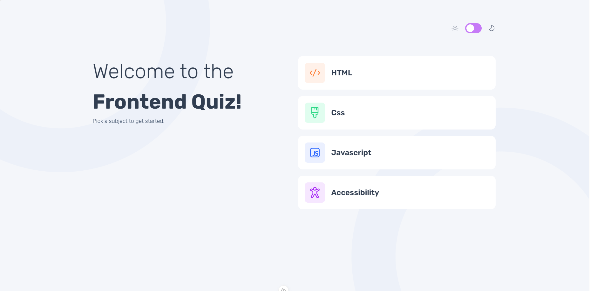
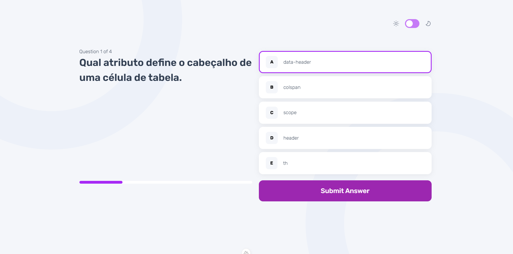
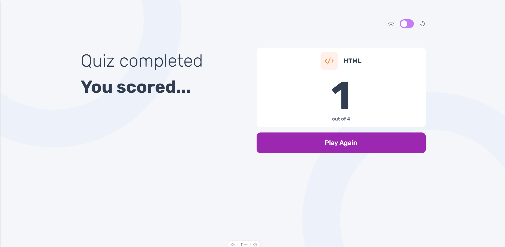
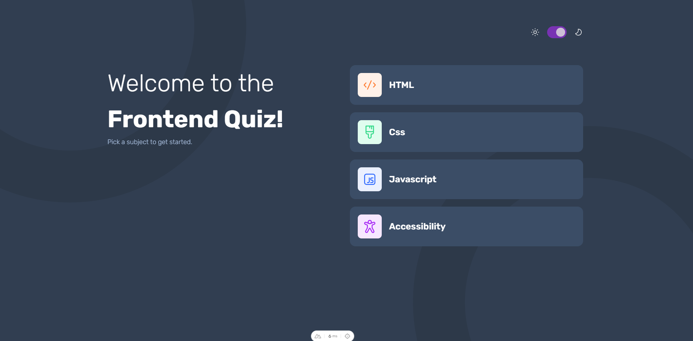

<h1>Quiz desenvolvido com Vue js</h1>
<h4>🚀 Projeto Frontend Quiz PWA  desenvolvido com Vue.js e Nuxt</h4>

<h2>🚧 Status do projeto</h2>

Em Progresso

<h2>🖥️ Pré-requisitos e como rodar a aplicação/testes</h2>

Antes de começar, você vai precisar ter instalado em sua máquina as seguintes ferramentas:
[Git](https://git-scm.com) 

<h3>Rodando a Aplicação</h3>
<ul>
	<li>Clone esse repositório(git clone)</li>
 	<li>Instale as dependências(npm install)</li>
	<li>Execute a aplicação em modo de desenvolvimento(npm run dev)</li>
 	<li>Acesse http://localhost:3000(Caso a porta esteja disponível) </li>
	<li>A api deve ser rodada localmente, para as intrucões de como rodar o backend é necessario entrar na pasta 'backend'
	</li>

</ul>

<h2>🤖 Tecnologias Utilizadas</h2>

  
  
  
  

<h2>🖼️ Demonstração da aplicação</h2>

<h4  style="display: inline_block">Visualização do site :</h4><a style="display: inline_block" target="blank" href="https://frontendquiz.com.br/">Preview na Vercel</a> 
<a style="display: inline_block" target="blank" href="https://play.google.com/store/apps/details?id=br.com.frontendquiz.twa">Acesso na play store</a> 
<a style="display: inline_block" target="blank" href="https://www.microsoft.com/store/productId/9P9FHGGR0JK7?ocid=pdpshare">Acesso na microsoft store</a>

<h2>🧑🏻‍ Autor</h2>

Feito por João paulo

